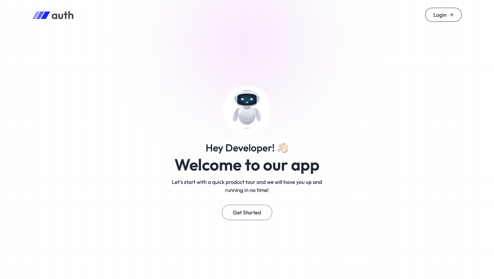
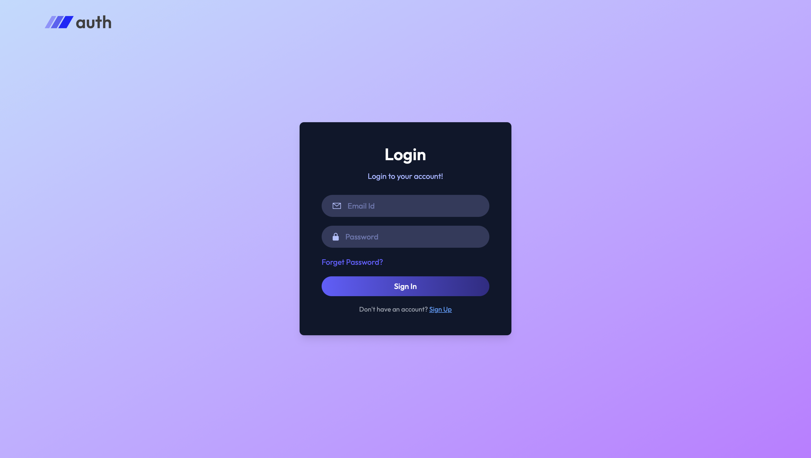
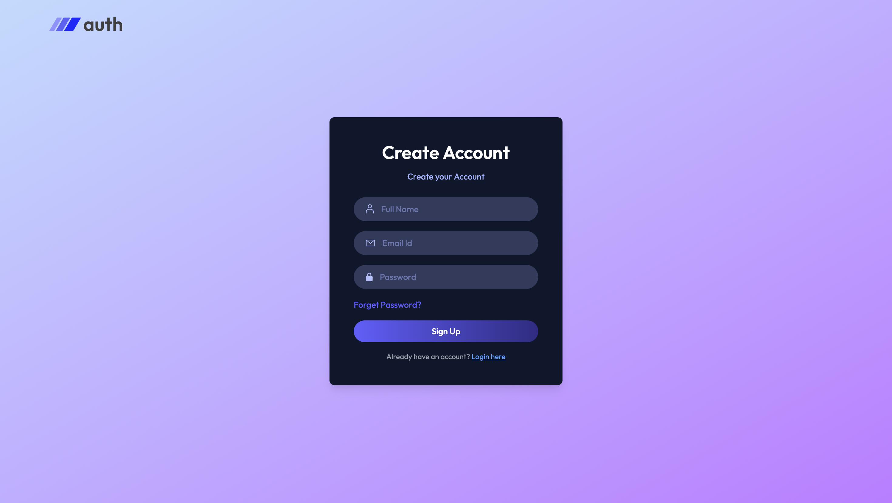

# 🔐 MERN AUTH – Secure Authentication System with Email OTP

A full-stack **MERN** (MongoDB, Express, React, Node.js) authentication boilerplate featuring **email OTP verification** for signup and password reset. Built for learning/production-ready auth flows.

**Live Demo:** (Add link once deployed – e.g. Vercel frontend + Render/Railway backend)  
**Backend API:** (e.g. https://mern-auth-backend.onrender.com/api)  

![Project Banner / Screenshot]
<h3>Home Page</h3>
  
<h3>Login Page</h3>
  
<h3>SignUp Page</h3>
  

## ✨ Key Features

- **User Registration** with email + password → OTP sent for verification
- **Email OTP Verification** (activates account)
- **Login** with JWT authentication
- **Forgot Password / Reset** using OTP (no insecure reset links)
- **Protected Routes** (Dashboard / Profile after login)
- Responsive, modern UI with **Tailwind CSS**
- Toast notifications for feedback
- Secure: Password hashing (bcrypt), JWT tokens, rate limiting (recommended)
- Environment variable support (.env)

## 🛠️ Tech Stack

### Frontend (Client/)
- React + Vite
- Tailwind CSS
- React Router DOM v6
- Axios (API calls)
- React Toastify

### Backend (Server/)
- Node.js + Express
- MongoDB (with Mongoose)
- JWT for tokens
- Nodemailer (for sending OTP emails)
- bcryptjs (password hashing)
